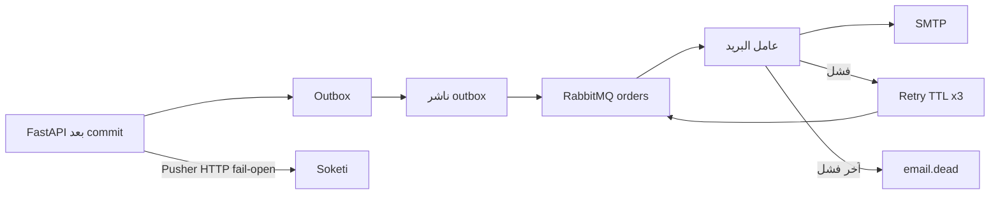

# معمارية المتطلبات 4

```mermaid
flowchart LR
  API[FastAPI بعد commit] --> O[Outbox]
  API -->|Pusher HTTP fail-open| S[Soketi]
  O --> P[ناشر outbox]
  P --> R[RabbitMQ orders]
  R --> W[عامل البريد]
  W --> SMTP[SMTP]
  W -->|فشل| Retry[Retry TTL x3]
  Retry --> R
  W -->|آخر فشل| DLQ[email.dead]
```

لا يرسل المتصفح من النسخة المتماثلة: يحمل حدث Soketi الطلب كاملا. الخادم يستخدم اسم الحاوية `soketi`، والمتصفح يستخدم `localhost:6001`.
